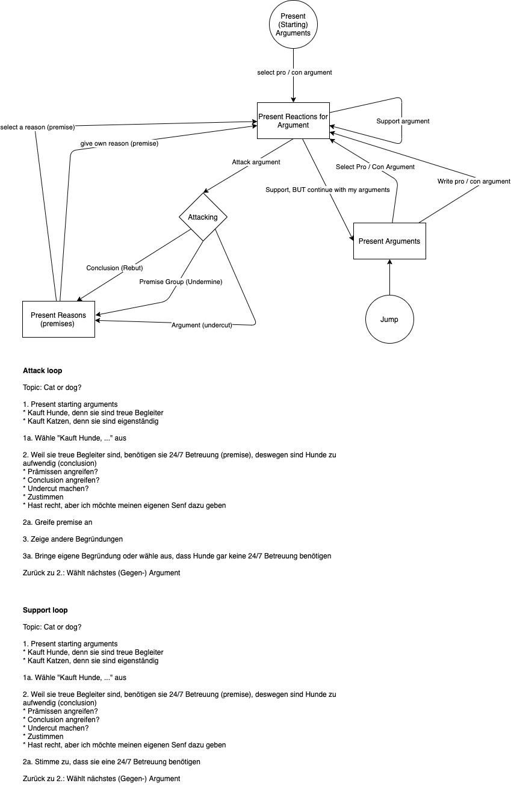

= dialog.core

This repository contains the core logic needed to conduct a dialog-based discussion.
Everything here is highly unstable at the current time.
Do *not* assume that the methods do not change.

== Usage as a Library

To properly use the dialog.core as a library you need to call the
`discussion.database/init` function with a configuration parameter first.
It needs to have at least two keys: `:datomic` and a datomic config map. and `:name`
with a database-name as value.

== CLI

Configure the application and a datomic database with the script `run.clj`.
You need to install https://github.com/borkdude/babashka/[babashka] for this script.

Usage:

    bb run.clj [options] argument

== Structure

=== Argumentation Engine

